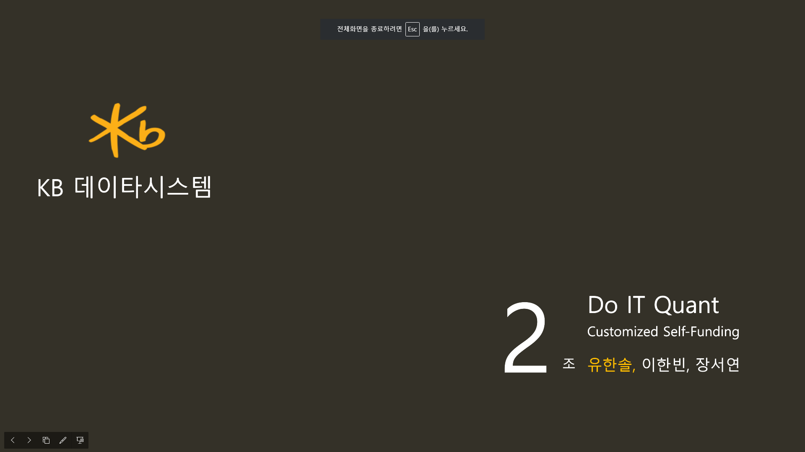

# React Native Tutorial repository

본 저장소는 리엑트 네이티브를 연습하기위해 만든 저장소 입니다.

KB데이타시스템 연수원 프로젝트를 성공적으로 마무리하기 위해 만들어 졌음을 밝힙니다.

## 현재까지 구현된 기능 (모두 완료)

해당 프로젝트는 KB데이터시스템의 연수과정 중 이루어진 것으로 1등으로 마무리 되었습니다. 다들 고생 많으셨습니다.

